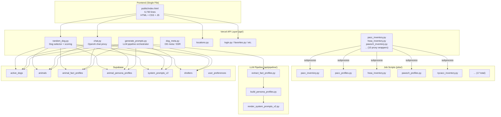

# ChattyHound Codebase Audit & Refactoring Roadmap

## Executive Summary

ChattyHound is a Vercel-deployed web app with a Supabase backend, consisting of ~15 API endpoints, ~17 scraper jobs, a 3-step LLM pipeline, and a **6,730-line monolithic HTML frontend**. The codebase has grown organically with each new shelter addition, resulting in **massive code duplication** across scrapers, API proxy wrappers, and shared utilities. This report identifies the highest-impact refactoring targets, ordered by priority.

---

## Architecture Overview



---

## 🔴 Priority 1: Shelter Scraper Duplication (CRITICAL)

> [!CAUTION]
> This is by far the largest source of technical debt and the #1 barrier to onboarding new shelters efficiently.

### The Problem

Every shelter has **two job files** (inventory + profiles) and **two API proxy wrappers**, totaling 4 files per shelter. Currently there are **7 shelters**, meaning **~28 files** that share enormous amounts of copy-pasted code.

#### Duplicated across every profile scraper:
| Pattern | Files containing identical copy |
|---|---|
| `BarkbotStore` class (DB operations) | [pacc_profiles.py](file:///Users/ray/repo/Reedr1208/barkbotv0/jobs/pacc_profiles.py#L193-L297), [pawsch_profiles.py](file:///Users/ray/repo/Reedr1208/barkbotv0/jobs/pawsch_profiles.py#L450-L539) + all others |
| `Settings` dataclass | Every `*_profiles.py` |
| `now_iso()` | Every single job file |
| `get_supabase_client()` | Every single job file (with **3 different implementations**) |
| `get_settings()` | Every `*_profiles.py` |
| `record_hash()`, `compute_diff()` | Every `*_profiles.py` |
| `guess_extension()`, `download_image_bytes()` | Every `*_profiles.py` |
| `record_run_start()`, `record_run_finish()` | Every `*_inventory.py` |
| `TRACKED_FIELDS` list | Every `*_profiles.py` |
| `main()` loop structure | Every `*_profiles.py` |

#### Duplicated API proxy wrappers:

The files [api/pacc_inventory.py](file:///Users/ray/repo/Reedr1208/barkbotv0/api/pacc_inventory.py) and [api/hssa_inventory.py](file:///Users/ray/repo/Reedr1208/barkbotv0/api/hssa_inventory.py) are **143-line files that are byte-for-byte identical** except for the script path on line 69 (`pacc_inventory.py` vs `hssa_inventory.py`). This pattern repeats for every shelter's inventory and profile proxy.

#### Three different `get_supabase_client()` implementations:

1. **API endpoints** (e.g., [random_dog.py](file:///Users/ray/repo/Reedr1208/barkbotv0/api/random_dog.py#L10-L15)): Uses `os.environ.get()` with fallbacks
2. **PACC inventory** ([pacc_inventory.py](file:///Users/ray/repo/Reedr1208/barkbotv0/jobs/pacc_inventory.py#L32-L38)): Uses `os.environ[]` with KeyError
3. **HSSA/NYCACC jobs** ([hssa_inventory.py](file:///Users/ray/repo/Reedr1208/barkbotv0/jobs/hssa_inventory.py#L35-L53)): Manually parses `.env.local` before reading env vars

### Recommended Refactoring

Create a shared library:

```
jobs/
  lib/
    __init__.py
    db.py              # get_supabase_client(), BarkbotStore, now_iso()
    scrape_run.py      # record_run_start(), record_run_finish()
    image.py           # download_image_bytes(), guess_extension(), upload_image()
    record.py          # TRACKED_FIELDS, record_hash(), compute_diff()
    settings.py        # Settings dataclass, get_settings(), env loading
  shelters/
    pacc/
      inventory.py     # Only shelter-specific parsing logic
      profiles.py      # Only shelter-specific extraction logic
      config.py        # SHELTER_ID, BASE_URL, CITY, STATE, SHELTER_NAME
    hssa/
      ...
```

**Impact**: Onboarding a new shelter would go from "copy 4 files, modify everything, hope nothing was missed" to "write 2 small files (parse inventory HTML, extract profile HTML) + 1 config file."

---

## 🔴 Priority 2: Monolithic Frontend (CRITICAL)

> [!WARNING]
> The entire frontend is a single 6,730-line HTML file containing all HTML structure, CSS, and JavaScript. This is the hardest file in the codebase to debug and modify safely.

### The Problem

[public/index.html](file:///Users/ray/repo/Reedr1208/barkbotv0/public/index.html) contains:
- **~1,500 lines of HTML** (DOM structure)
- **~1,800 lines of CSS** (all styles inlined in `<style>` tags)
- **~3,400 lines of JavaScript** (all logic in `<script>` tags)
- All global variables, all event handlers, all UI rendering, all API calls

When I need to fix a bug (like the random dog location issue earlier), I must:
1. Search through 6,730 lines to find the relevant function
2. Hold the entire file's state model in context
3. Hope my line number references are correct since there's only one file
4. Risk accidental edits to unrelated sections

### What Makes This Hard for AI Agents

- **Context window pressure**: Viewing 800 lines at a time means I need ~9 reads just to see the full file
- **No module boundaries**: Everything is globally scoped, so any function can depend on any variable
- **No type information**: All JavaScript is untyped, making it harder to trace data flow
- **Edit collisions**: When making a fix, I have to carefully specify exact line ranges in a 6,730-line file

### Recommended Approach

At minimum, split into 3 files:
```
public/
  index.html          # HTML structure only (~1,500 lines)
  styles.css          # All CSS (~1,800 lines)
  app.js              # All JavaScript (~3,400 lines)
```

Even better, modularize the JavaScript:
```
public/
  js/
    state.js           # Global state (viewedIds, currentDogData, userCoords, etc.)
    api.js             # fetchRandomDog(), chat API calls
    ui.js              # DOM manipulation, rendering
    preferences.js     # Preference center logic
    share.js           # Share functionality
    saved.js           # Saved dogs modal
    utils.js           # cleanAgeText(), formatRelativeTime(), etc.
```

> [!NOTE]
> This doesn't require a framework migration. Plain ES modules with `<script type="module">` work in all modern browsers and on Vercel.

---

## 🟡 Priority 3: `random_dog.py` Complexity

### The Problem

[random_dog.py](file:///Users/ray/repo/Reedr1208/barkbotv0/api/random_dog.py) is a **522-line single function** (`do_GET`) that handles:
- Direct dog lookup by animal_id (lines 99-146)
- User geolocation parsing (lines 148-177)
- Full active_dogs fetch with pagination (lines 179-203)
- Shelter data fetching (lines 187-189)
- Persona data fetching (lines 192-193)
- Fact profile data fetching (lines 196-200)
- User preference loading and merging (lines 220-244)
- Location hard filtering (lines 269-285)
- Multi-criteria scoring with 4 dimensions (lines 287-375)
- Freshness categorization (lines 377-375)
- Weighted random selection with bio-length weighting (lines 393-431)
- Match badge determination (lines 446-451)
- Profile enrichment from 3 tables (lines 453-489)
- Suggested location calculation (lines 494-500)

The bug we fixed earlier (proximity scoring being skipped) was caused by the interaction of 3 different conditional branches across 80+ lines. This is the riskiest endpoint to modify.

### Recommended Refactoring

Extract into focused functions:
```python
def resolve_direct_lookup(client, animal_id) -> dict | None
def determine_user_region(query_params, headers) -> tuple[float, float, str] | None  
def load_candidate_pool(client) -> dict
def apply_preference_filters(candidates, preferences, shelters_map) -> list
def score_candidates(candidates, preferences, closer_region, persona_data, viewed_list) -> dict
def select_dog(scored_dogs, viewed_ids, fresh_status) -> str
def enrich_profile(client, animal_id, active_dogs, shelters_map) -> dict
```

---

## 🟡 Priority 4: No Database Schema Source of Truth

### The Problem

- [barkbot_schema.sql](file:///Users/ray/repo/Reedr1208/barkbotv0/barkbot_schema.sql) exists but is **incomplete and stale** — it doesn't include `active_dogs`, `shelters`, `animal_fact_profiles`, `animal_persona_profiles`, `system_prompts_v2`, or `persona_archetypes`
- The real schema lives only in the Supabase dashboard
- No migration system exists — schema changes are made manually in the dashboard
- Column names and types must be inferred from code reading

### What This Means for AI Agents

When I need to understand what columns `active_dogs` has, I must grep across all files that query it and infer the schema from the `select()` and `insert()` calls. This is error-prone and time-consuming.

### Recommendation

Maintain a complete, authoritative `schema.sql` in the repo. Even without a migration tool, a manually-updated file that reflects the actual Supabase schema would be transformative for AI understanding.

---

## 🟡 Priority 5: Stale/Orphaned Files

The project root contains many files that appear to be scratch work, old versions, or development artifacts:

| File | Status |
|---|---|
| [example.html](file:///Users/ray/repo/Reedr1208/barkbotv0/example.html) (153KB) | Old copy of index.html |
| [scratch_script.js](file:///Users/ray/repo/Reedr1208/barkbotv0/scratch_script.js) (131KB) | Old copy of frontend JS |
| [chattyhound_mobile_redesign_mockup.jsx](file:///Users/ray/repo/Reedr1208/barkbotv0/chattyhound_mobile_redesign_mockup.jsx) | Design mockup |
| [WorkingFiles/](file:///Users/ray/repo/Reedr1208/barkbotv0/WorkingFiles) (18 files) | Old scraper versions, logs, CSVs |
| `test_*.py`, `scratch_*.py`, `query_db.js` | Ad-hoc test/debug scripts |
| [local_server.py](file:///Users/ray/repo/Reedr1208/barkbotv0/local_server.py) | Possibly unused local server |
| [recommendations.md](file:///Users/ray/repo/Reedr1208/barkbotv0/recommendations.md) | Old recommendations |

These files create noise when searching the codebase and make it harder to identify the canonical version of things.

---

## 🟢 Priority 6: Mixed Execution Environments

### Vercel Crons vs GitHub Actions

Some shelters run via Vercel cron jobs (PACC, PAWSCH, AHSCN, WWLA, Muddypaws) while others run via GitHub Actions (HSSA, NYCACC, HHS). The split appears to be based on whether Playwright is needed, but this isn't documented anywhere.

| Execution | Shelters | Reason |
|---|---|---|
| Vercel Cron | PACC, PAWSCH, AHSCN, WWLA, MP | Simple HTTP scraping or Vercel cron |
| GitHub Actions | HSSA, NYCACC, HHS | Need Playwright (dynamic JS rendering) |

### The `.env` Loading Problem

Because of this split, jobs have **three different patterns** for loading environment variables:
1. API endpoints rely on Vercel's built-in env injection
2. Vercel cron proxy wrappers manually parse `.env.local`
3. GitHub Actions jobs also manually parse `.env.local` (but don't need to since GH Actions injects secrets)

---

## What I Need From You

### 1. Complete Database Schema Export

**Action**: Run this in the Supabase SQL editor and share the output:
```sql
SELECT table_name, column_name, data_type, is_nullable, column_default
FROM information_schema.columns
WHERE table_schema = 'public'
ORDER BY table_name, ordinal_position;
```

This gives me the ground truth for every table and column, which I can then commit as an authoritative `schema.sql`.

### 2. Shelter Onboarding Manifest

**Action**: Create a simple document listing each shelter with:
- Shelter ID (e.g., `PACC`, `HSSA`)
- Display name
- City/State
- Scraping method (HTTP / Playwright / API)
- Source URL
- Execution environment (Vercel cron / GitHub Action)
- Any special quirks or notes

This becomes the reference document for onboarding new shelters.

### 3. Supabase Access for Read-Only Queries

For debugging issues like the random dog selector bug, being able to query the actual data (e.g., "how many active dogs are in each shelter?") would dramatically speed up diagnosis. If you could provide a read-only Supabase key or a way for me to run `SELECT` queries, that would be ideal.

### 4. Test Data Fixtures

**Action**: Export a small representative sample from each key table:
- 5-10 rows from `active_dogs` (mix of shelters)
- 5-10 rows from `animals` 
- 5-10 rows from `shelters`
- 2-3 rows from `animal_fact_profiles`

These become test fixtures that I can use to write and run tests locally without hitting the production database.

---

## Ideal Testing Setup

### Current State: No Tests

There are zero automated tests in the project. The ad-hoc `test_*.py` files in the root are one-off scripts that query the production database directly.

### Recommended Testing Layers

#### Layer 1: Unit Tests (immediate value, no infrastructure needed)

Target the pure logic functions that exist across the codebase:
```
tests/
  test_scoring.py        # Test the scoring logic from random_dog.py
  test_age_classifier.py # Test classify_age_group(), matches_gender()
  test_parsers.py        # Test each shelter's HTML parsing (with saved HTML fixtures)
  test_record_hash.py    # Test record_hash(), compute_diff()
```

**Fixtures approach**: Save actual HTML pages from each shelter (already partially done in `WorkingFiles/`) and test the parsing functions against them. When a shelter changes their HTML, the test fails and shows exactly what broke.

#### Layer 2: Integration Tests (requires test fixtures)

```
tests/
  test_random_dog_flow.py   # Mock Supabase, test the full scoring + selection flow
  test_generate_prompts.py  # Mock OpenAI + Supabase, test the pipeline orchestration
```

#### Layer 3: End-to-End Smoke Tests

A simple script that:
1. Hits `/api/random_dog` and verifies the response shape
2. Hits `/api/locations` and verifies shelters are returned
3. Hits `/api/chat` with a test message and verifies a reply comes back

### Test Runner

Add `pytest` to `requirements.txt` and a simple `pytest.ini`:
```ini
[pytest]
testpaths = tests
```

---

## Structural Optimizations for AI-Assisted Development

### 1. Add a `ARCHITECTURE.md` File

A brief document in the repo root that I can read at the start of any session:
```markdown
# Architecture

## Data Flow
1. Inventory scrapers → active_dogs table
2. Profile scrapers → animals table  
3. LLM pipeline → animal_fact_profiles → animal_persona_profiles → system_prompts_v2
4. Frontend → /api/random_dog (dog selection) → /api/chat (conversation)

## Key Tables
- active_dogs: Currently adoptable dogs (wiped and refreshed per shelter)
- animals: Detailed profiles with bios and images
- shelters: Shelter metadata, display names, locations
...

## Shelter Registry
| ID | Name | City | Method | Cron |
...
```

### 2. Type Hints and Docstrings in Python

The codebase is almost entirely untyped. Adding return types and parameter types to key functions would let me navigate code much faster:

```python
# Current
def select_weighted_dog(candidates):

# Better  
def select_weighted_dog(candidates: list[str]) -> str | None:
    """Select a dog ID from candidates, weighted by bio length."""
```

### 3. Constants File

Create a `config.py` or `constants.py` with all the magic values currently scattered across files:
```python
# Scoring weights
PROXIMITY_BONUS = 0.8
ARCHETYPE_DIVERSITY_BONUS = 0.5
BIO_LENGTH_CAP = 800
BIO_BASELINE_WEIGHT = 10

# Freshness
FRESHNESS_WINDOW_DAYS = 3

# Pipeline
MIN_BIO_LENGTH_DEFAULT = 400
DOGS_PER_PROFILE_RUN = 30
MAX_EXECUTION_TIME_SECONDS = 240
```

### 4. Consistent Logging

Currently some files use `print()`, others use `logging`, and API endpoints use a mix. Standardize on `logging` with a consistent format, and include the shelter ID and animal ID in every log line.

### 5. GitHub Actions for CI

Add a basic CI workflow:
```yaml
name: CI
on: [push, pull_request]
jobs:
  test:
    runs-on: ubuntu-latest
    steps:
      - uses: actions/checkout@v4
      - run: pip install -r requirements.txt pytest
      - run: pytest tests/ -v
```

---

## Refactoring Execution Order

If I were to execute this refactoring, I'd recommend this order:

| Phase | What | Why First | Estimated Effort |
|---|---|---|---|
| **1** | Extract shared `jobs/lib/` from scrapers | Eliminates most duplication, unblocks new shelter onboarding | 1 day |
| **2** | Create single parameterized API proxy wrapper | Eliminates 10+ identical files, just one wrapper + config | 2 hours |
| **3** | Get schema.sql up to date | Unlocks everything else (testing, documentation, AI understanding) | 30 min (from you) |
| **4** | Split `index.html` into HTML + CSS + JS | Makes frontend bugs much easier to locate and fix | 3-4 hours |
| **5** | Refactor `random_dog.py` into functions | Reduces risk of scoring bugs | 2-3 hours |
| **6** | Add unit tests for parsing + scoring | Prevents regressions on future changes | 3-4 hours |
| **7** | Clean up orphaned files | Reduces noise in search and navigation | 30 min |
| **8** | Add `ARCHITECTURE.md` + constants | Speeds up every future AI session | 1 hour |

---

## Summary of Key Metrics

| Metric | Current | After Refactoring |
|---|---|---|
| Files to copy for new shelter | ~4 (800+ lines total) | ~3 (100-200 lines total) |
| `get_supabase_client()` implementations | 3 different versions | 1 shared version |
| Frontend files | 1 × 6,730 lines | 3-8 focused files |
| `random_dog.py` `do_GET` length | 422 lines, 1 function | 7-8 functions, ~60 lines each |
| Automated tests | 0 | 20-30 (after Phase 6) |
| Schema documentation | Partial, stale | Complete, authoritative |
